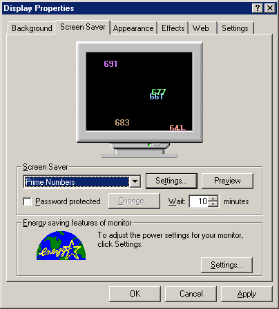



## Prime Number Screen Saver

### Description

This example screen saver provides a good example on how to write a complete screen saver. This particular one figures out prime numbers, then prints them streaming across the screen. Complete with options and docking procedures.
 
### More Info
 

             |
---                |---
**Submitted On**   |2001-07-04 20:09:46
**By**             |[Jon Feucht](https://github.com/Planet-Source-Code/PSCIndex/blob/master/ByAuthor/jon-feucht.md)
**Level**          |Advanced
**User Rating**    |5.0 (10 globes from 2 users)
**Compatibility**  |VB 4\.0 \(32\-bit\)
**Category**       |[Graphics](https://github.com/Planet-Source-Code/PSCIndex/blob/master/ByCategory/graphics__1-46.md)
**World**          |[Visual Basic](https://github.com/Planet-Source-Code/PSCIndex/blob/master/ByWorld/visual-basic.md)
**Archive File**   |[Prime Numb22220742001\.zip](https://github.com/Planet-Source-Code/jon-feucht-prime-number-screen-saver__1-24741/archive/master.zip)

